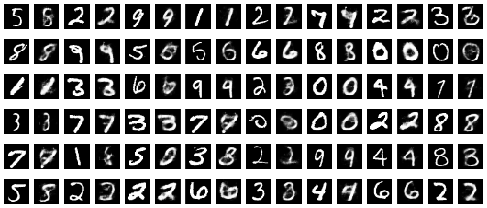

# Uncertainty-Autoencoder-Based Privacy and Utility Preserving Data Type Conscious Transformation (UAE-PUPET)

This repository provides the source code as described in the paper:

```
Directory Structure:

uae-pupet
├── .DS_Store     
├── __pycache__   
├── adversaries_and_utility         #weak and strong adversary and utility provider
│   ├── MNIST
│   ├── FashionMNIST           
│   ├── UCIAdult            
│   └── USCensus
├── generated_images                #save here: original vs private image. (sample images in "results" folder)
├── results                         #save results here
│   ├── Figures
│   ├── UPTCurves
│   ├── ...
├── TrainData.csv                   #training data for US Demographic Census Data (USCensus)                      
├── TestData.csv                    #testing data for US Demographic Census Data (USCensus)  
├── adult.csv                       #training and testing data for UCI Adult (UCIAdult)
├── dataset.py                      #dataset pre-processing
├── model.py                        #build models with respect to the dataset
├── original_vs_private_image.py    #generates original vs private image
├── train_preprocessing.py          #additional preprocessing before in order to train the model
├── get_results.py                  #outputs result of the best performing adversary and utility provider
├── loss_curves.py                  #outputs loss curves after training is complete
├── main.py                         #main file for data type unaware conditions and saves results (to run file)
├── data-type-aware-main.py         #main file for data type aware conditions and saves results (to run file)
├── get_final_results.py            #compile all the results together
└── run.sh                          #bash script to run main.py or data-type-aware-main.py (optional)
```

## Requirements

1. Use google colaboratory to stay away from the hassle of installing different libraries for the implementation of the source code provided in this repository.
2. Otherwise, you can create your own virtual environment and install the following dependencies: python = 3.7.12, pandas = 1.3.5, numpy = 1.19.5, tensorflow = 2.7.0, keras = 2.7.0, sklearn = 1.0.2, matplotlib =3.2.2.

Note: This repository doesn't contain a "requirements.txt" file.

## Usage
For data type ignorant conditions, run main.py with appropriate command line arguments:

1. Dataset: -d MNIST, FashionMNIST, UCIAdult or USCensus
2. Generator: -g UAE, AE or VAE
3. Epochs: -e 40 (By default)
4. Lambda_p: -p 30 or (Suggested range as per experiments [0, 10, 20, ... 100])
5. Overwrite: -o true or false (mentioned lambda_p only works if -o true otherwise default value is used according to dataset)

Example:
```
python PUPET-Official/main.py -d MNIST -g UAE -p 40 -o true
```

For data type aware conditions, run data-type-aware-main.py with appropriate command line arguments:

1. Generator: -g UAE, AE or VAE
2. Epochs: -e 100 (By default)
3. Lambda_p: -p 10 (By deafult) or (Suggested range as per experiments [0, 1, 2, ... 10])

Example:
```
python PUPET-Official/data-type-aware-main.py -g UAE -e 90 -p 5
```

Or you can use the bash script as per your requirement to train and get results, example usage:
```
bash PUPET-Official/run.sh
```

## Results
1. The folder "results" consists of accuracy and auroc scores for different datasets.
    1. General structure of the output file: results/MNIST/UAE-10-private_acc.txt
    2. This means the output file is belongs to the result for MNIST dataset when lambda_p = 10.
    3. The generator used is UAE(Uncertainty Autoencoder) and the result is the inference accuracy of the private feature.
2. UPTCurve consists of Utility Privacy Tradeoff Curves.
3. Figures contain some other figures related to this paper and repository.

## Generated Images (Original vs Privatized)
Odd columns are original images and even columns refer to its corresponding privatized images.

Note: generated_images folder is kept empty (to save space). Once you run the main file, it will start saving images there.

<p align = "center">

</p>
<p align = "center">
Fig.1 - Original v/s Privatized MNIST image
</p>

<p align = "center">

</p>
<p align = "center">
Fig.2 -  Original v/s Privatized Fashion MNIST image
</p>

## Latent Variable Visualisation
<p align = "center">

</p>
Fig. 3 Visualisation of latent variable before and after the privacy mechanism (UAE-PUPET) for MNIST dataset when the dimension of latent variable = 2. 
<p align = "center">
</p>

## UPT Curves
Lines in the plot refer to the upper convex hull points. We focus on those points because, ideally, we don't want points which fall in shadow region. (Interpretation: Points lying on north-west regions are favorable.)

<p align = "center">

</p>
<p align = "center">
Fig.4 - UPT curves: For all experiments consisting data-type-ignorant conditions. Each point is the mean of 25 experiments for a particular lambda p value.
</p>

## Loss Curves
<p align = "center">

</p>
<p align = "center">
Fig.5 - Loss Curves for MNIST dataset. Here we only show the values of privacy requirement from 0 to 30. Our actual experiments took over a range of (0,100).
</p>

---
## Citation
If you find UAE-PUPET useful in your research, please consider citing our paper:
```
Bibtex citation will be available soon.
```
